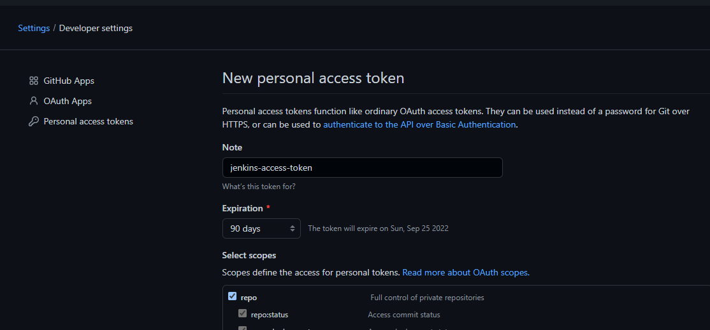
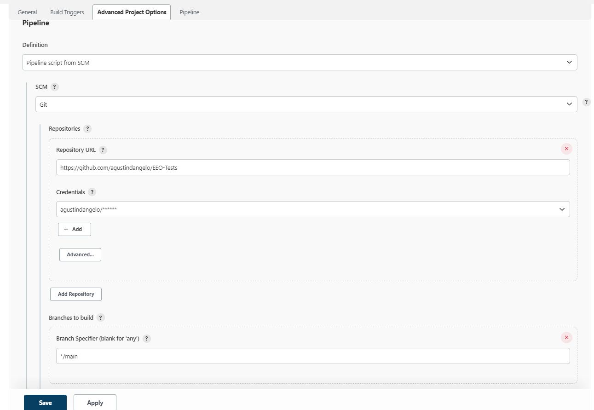

# EEO Demos

Two automated test suites are going to be developed. 
Cypress tests are located in `cypress/e2e` and WebdriverIO tests are located in `wdio/test/specs`

# Install dependencies
```
npm install
```

# Run Cypress tests
Create a `cypress.env.json` file at the root of the project and paste with the following content:
```json
{
  "USER_EMAIL": "<your-email>",
  "USER_NAME": "<your-username>",
  "USER_PASSWORD": "<your-password>",
  "LOCAL_API_URL": "http://localhost:4000"
}
```
Make sure to have both eeoweb and eeoservice up and running before running the tests on the local environment

Run tests from the graphical test runner:
```
npm run cy:ui
```

Run the tests from the CLI and generate a Mochawesome report
```
npm run cy:run
```
tests execution reports should be available at `mochawesome-report/`

## Run a tagged test suite
To run a specific test suite specify its tag as follows:

bash:
```CYPRESS_INCLUDE_TAGS=HappyPath npm run cy:run```

powershell:
```cmd /C "set CYPRESS_INCLUDE_TAGS=HappyPath && npm run cy:run"```

<br>

# Setup a Jenkins local instance
1. Download the [latest stable Jenkins WAR file](https://www.jenkins.io/download/) to an appropriate directory on your machine.
2. Run the jenkins instance with `java -Dhudson.model.DirectoryBrowserSupport.CSP="" -jar jenkins.war` and navigate to `http://localhost:8080`. The first time you will be asked for a password. Refer to the official documentation for any inconveniences: https://www.jenkins.io/doc/book/installing/war-file/
3. Create a new pipeline by clicking the `New Item` button on the Jenkins' UI. You can name it "eeo-pipeline".
4. On the pipeline configuration page, scroll down to the **Pipeline** section or click on the **Pipeline** tab.
5. On the **Definition** field, select "Pipeline script from SCM"
6. On the SCM field, select Git.
7. On the repository URL, enter the GitHub repo URL: https://github.com/agustindangelo/EEO-Tests. A red message saying that Jenkins couldn't connect to the repository may appear. That's why we need to grant Jenkins access to read the repository and your GitHub account user information.
8. In order to grant access to Jenkins, you need to create an access token on your Github account with scopes "repo" and "user". You can name it something like "jenkins-access-token".

9. Copy the access token and go back to Jenkins. click on the **Add** button below the repository URL and select Jenkins to create a new credential.
10. In the **Username** field, paste your GitHub username and paste the access token in the **Password** field.
11. Save the credential. Now the red message saying that Jenkins couldn't connect to the repo should disappear from the screen.

12. In the **Script Path** field, type "Jenkinsfile" and Save the pipeline.
13. From the Jenkins Dashboard, go to `Manage Jenkins` > `Manage Plugins` and install the plugin **AnsiColor** to colorize commands output during the build.
14. From the Jenkins Dashboard, navigate to `Manage Jenkins` > `Credentials`, click on the Jenkins entry below the **Stores scoped to Jenkins** dialog, click on `Global credentials (unrestricted)`, click on `+ Add Credentials` and create a **Secret text** type of credential with ID `USER_PASSWORD` and type your EEO password as secret value.
14. From the Jenkins dashboard, click on your recently created pipeline and click on the **Build now** button.
